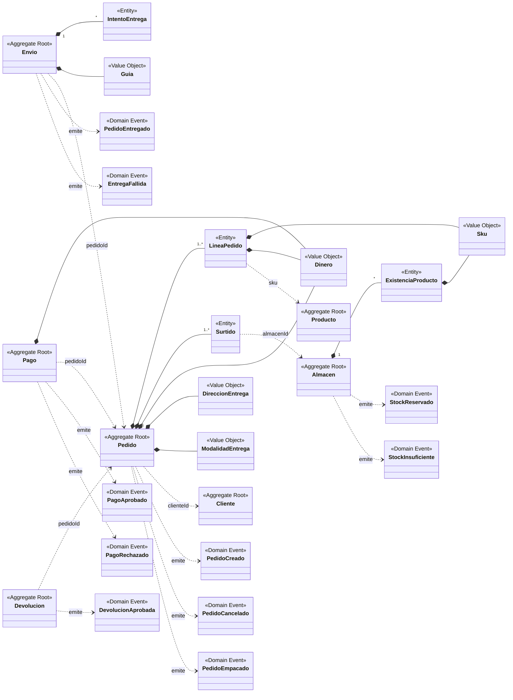

# PetMarket · Diagrama DDD

```mermaid
classDiagram
direction LR

class Pedido { <<Aggregate Root>> }
class LineaPedido { <<Entity>> }
class Surtido { <<Entity>> }
class Almacen { <<Aggregate Root>> }
class ExistenciaProducto { <<Entity>> }
class Pago { <<Aggregate Root>> }
class Envio { <<Aggregate Root>> }
class IntentoEntrega { <<Entity>> }
class Devolucion { <<Aggregate Root>> }
class Cliente { <<Aggregate Root>> }
class Producto { <<Aggregate Root>> }

class Dinero { <<Value Object>> }
class DireccionEntrega { <<Value Object>> }
class ModalidadEntrega { <<Value Object>> }
class Sku { <<Value Object>> }
class Guia { <<Value Object>> }

class PedidoCreado { <<Domain Event>> }
class PedidoCancelado { <<Domain Event>> }
class PedidoEmpacado { <<Domain Event>> }
class StockReservado { <<Domain Event>> }
class StockInsuficiente { <<Domain Event>> }
class PagoAprobado { <<Domain Event>> }
class PagoRechazado { <<Domain Event>> }
class PedidoEntregado { <<Domain Event>> }
class EntregaFallida { <<Domain Event>> }
class DevolucionAprobada { <<Domain Event>> }

Pedido "1" *-- "1..*" LineaPedido
Pedido "1" *-- "1..*" Surtido
Pedido *-- Dinero
Pedido *-- DireccionEntrega
Pedido *-- ModalidadEntrega
LineaPedido *-- Sku
LineaPedido *-- Dinero
Almacen "1" *-- "*" ExistenciaProducto
ExistenciaProducto *-- Sku
Envio "1" *-- "*" IntentoEntrega
Envio *-- Guia
Pago *-- Dinero

Pedido ..> Cliente : clienteId
LineaPedido ..> Producto : sku
Surtido ..> Almacen : almacenId
Pago ..> Pedido : pedidoId
Envio ..> Pedido : pedidoId
Devolucion ..> Pedido : pedidoId

Pedido ..> PedidoCreado : emite
Pedido ..> PedidoCancelado : emite
Pedido ..> PedidoEmpacado : emite
Almacen ..> StockReservado : emite
Almacen ..> StockInsuficiente : emite
Pago ..> PagoAprobado : emite
Pago ..> PagoRechazado : emite
Envio ..> PedidoEntregado : emite
Envio ..> EntregaFallida : emite
Devolucion ..> DevolucionAprobada : emite
```
